# JustView - Reporte de Arquitectura y Herramienta

## 1. Descripción de la Herramienta
JustView es una aplicación web minimalista y dinámica diseñada para la carga, procesamiento y visualización de datos de manera interactiva. Permite a los usuarios importar múltiples conjuntos de datos (datasets) en formato CSV o Excel, aplicar técnicas de limpieza de datos en el proceso (como manejo de valores nulos, duplicados y valores atípicos), y crear configuraciones de gráficos interactivos (Barras, Líneas, Pastel, Dispersión e Histogramas). Su interfaz de usuario actúa como un tablero (dashboard) que permite analizar la información proveniente de múltiples fuentes y configurar diferentes tipos de visualizaciones simultáneamente.

## 2. Tecnologías Empleadas

### Backend
* **Lenguaje:** Python 3
* **Framework Web:** FastAPI (proporciona una API REST rápida, asíncrona y autodescriptiva).
* **Servidor ASGI:** Uvicorn.
* **Procesamiento de Datos:** Pandas (utilizado extensivamente para lectura, limpieza y transformación de los DataFrames).
* **Visualización (Generación):** Plotly Express / Plotly.io (empleado para agrupar los datos y generar las definiciones JSON interactivas de los gráficos).
* **Validación de Datos:** Pydantic (para validación estricta y control de esquemas fuertemente tipados de cada configuración gráfica según su tipo).

### Frontend
* **Core Web:** React 19 (Componentes funcionales, Hooks).
* **Build Tool:** Vite (empaquetado optimizado y desarrollo ultrarrápido).
* **Renderizado de Gráficos:** Plotly.js (vía `react-plotly.js`), encargado de interpretar el JSON del backend y dibujar canvas enriquecidos e interactivos.
* **Estilos:** Vanilla CSS (`index.css`), adoptando un enfoque de diseño monocromático, minimalista y responsivo (Flexbox/Grid).
* **Iconografía:** Lucide-React.

### Infraestructura
* **Contenerización:** Docker y Docker Compose para facilitar la distribución del entorno, aislando el backend (en el puerto 8000) y el frontend (en el puerto 5173).

## 3. Arquitectura del Sistema
El sistema adopta una arquitectura **Cliente-Servidor** clásica, dividida en dos capas lógicas principales conectadas por HTTP/REST:

1. **Frontend (SPA - Single Page Application):** Maneja el estado complejo en el lado del cliente (como múltiples datasets activos, gráficos asociados y vistas). Interactúa con el backend consumiendo endpoints JSON. Al usar React, la interfaz reacciona instantáneamente a cambios en las variables de configuración.
2. **Backend (API REST Stateless / Memoria Efímera):** Por diseño simple, expone rutas POST para procesar archivos y solicitar gráficos. Utiliza un almacén global en memoria (`DATASETS_STORE`) para mantener los DataFrames vivos mientras dure el ciclo de ejecución del servidor usando identificadores únicos (UUIDs).

### Patrones de Diseño (Backend)
El backend está estructurado en base a un alto grado de modularización, utilizando primordialmente el **Patrón Strategy (Estrategia)**. Esta arquitectura hace que la plataforma sea de código limpio y altamente extensible (Open/Closed Principle). Existen tres familias de estrategias principales:

* **Estrategias de Lectura (`DataReaderStrategy`):** Se delega la responsabilidad de lectura de los bytes binarios y su conversión a DataFrame según la extensión (`CSVReaderStrategy`, `ExcelReaderStrategy`).
* **Estrategias de Procesamiento (`DataProcessorStrategy`):** Diferentes métodos de limpieza y tratamiento son encapsulados en sus propias clases, que luego son iteradas por un `ProcessorContext` (`NullHandlerStrategy`, `DuplicateHandlerStrategy`, `OutlierHandlerStrategy`).
* **Estrategias de Visualización (`VisualizerStrategy`):** Separa la lógica de preparación, validación, agrupación y visualización final para cada familia de gráficos (`BarChartStrategy`, `LineChartStrategy`, `PieChartStrategy`, etc.).

---

## 4. Diagrama de Clases

A continuación se presenta el diagrama de clases de la aplicación enfocado principalmente en la lógica de las estrategias en el Backend. Este bloque de código está en formato **Mermaid** y será renderizado automáticamente por visores Markdown modernos o pegándolo en el Mermaid Live Editor:

```mermaid
classDiagram

    %% Controladores Principales
    class FastAPIApp {
        +DATASETS_STORE: dict
        +upload_file(file, process_options)
        +generate_chart(request)
    }

    %% Estrategias de Lectura de Archivos
    class DataReaderStrategy {
        <<interface>>
        +read(file_content, filename) DataFrame
    }
    class CSVReaderStrategy {
        +read(file_content, filename) DataFrame
    }
    class ExcelReaderStrategy {
        +read(file_content, filename) DataFrame
    }
    class ReaderContext {
        -_strategy: DataReaderStrategy
        +set_strategy(strategy)
        +execute_read(file_content, filename) DataFrame
    }

    %% Estrategias de Procesamiento de Datos
    class DataProcessorStrategy {
        <<interface>>
        +process(df, options) DataFrame
    }
    class NullHandlerStrategy {
        +process(df, options) DataFrame
    }
    class DuplicateHandlerStrategy {
        +process(df, options) DataFrame
    }
    class OutlierHandlerStrategy {
        +process(df, options) DataFrame
    }
    class ProcessorContext {
        -_strategies: List~DataProcessorStrategy~
        +add_strategy(strategy)
        +execute_processing(df, options) DataFrame
    }

    %% Estrategias de Visualización de Gráficos
    class VisualizerStrategy {
        <<interface>>
        +generate_chart_json(df, common_config, specific_config) String
    }
    class BarChartStrategy {
        +generate_chart_json(df, common_config, specific_config) String
    }
    class LineChartStrategy {
        +generate_chart_json(df, common_config, specific_config) String
    }
    class PieChartStrategy {
        +generate_chart_json(df, common_config, specific_config) String
    }
    class ScatterChartStrategy {
        +generate_chart_json(df, common_config, specific_config) String
    }
    class HistogramStrategy {
        +generate_chart_json(df, common_config, specific_config) String
    }

    %% Relaciones
    DataReaderStrategy <|.. CSVReaderStrategy
    DataReaderStrategy <|.. ExcelReaderStrategy
    ReaderContext o-- DataReaderStrategy

    DataProcessorStrategy <|.. NullHandlerStrategy
    DataProcessorStrategy <|.. DuplicateHandlerStrategy
    DataProcessorStrategy <|.. OutlierHandlerStrategy
    ProcessorContext o-- DataProcessorStrategy

    VisualizerStrategy <|.. BarChartStrategy
    VisualizerStrategy <|.. LineChartStrategy
    VisualizerStrategy <|.. PieChartStrategy
    VisualizerStrategy <|.. ScatterChartStrategy
    VisualizerStrategy <|.. HistogramStrategy
    
    FastAPIApp --> ReaderContext : Utiliza
    FastAPIApp --> ProcessorContext : Utiliza
    FastAPIApp --> VisualizerStrategy : Obtiene a través de Factory
```

