# Documentación Técnica de JustView

## Tecnologías Principales

JustView está construido bajo una arquitectura cliente-servidor, que distribuye responsabilidades entre un Frontend reactivo y un Backend capacitado para el procesamiento de datos científicos.

### Frontend
- **React (con Vite):** Provee una interfaz de usuario modularizada y rápida, mejorada gracias a la compilación instantánea de Vite.
- **react-plotly.js:** Librería de renderizado de gráficos altamente dinámica y capaz de recibir especificaciones JSON en crudo desde el backend.
- **lucide-react:** Iconografía vectorial minimalista (por ejemplo, el ícono del Ojo de la aplicación).

### Backend
- **Python (3.9+):** Lenguaje núcleo para todas las operaciones en el servidor.
- **FastAPI:** Framework moderno de alto rendimiento que sirve los endpoints (`/api/upload` y `/api/chart`) e inyecta validación estricta utilizando esquemas de `Pydantic`.
- **Pandas:** El motor de carga (letras de CSV y Excel), tratamiento y limpieza de registros, agrupaciones lógicas y matemáticas del dataset.
- **Plotly (Express & IO):** Generador de las configuraciones y layout en formato JSON para que el frontend pueda pintar los gráficos (ej. `px.bar`, `px.line`).

---

## Implementación de Clases: Patrón Strategy

El diseño del backend gira alrededor del **Patrón Strategy (Estrategia)**, el cual permite definir familias de algoritmos y hacerlos intercambiables dinámicamente dependiendo del archivo o la solicitud del usuario (sin usar cientos de condicionales `if/else`). 

Este patrón se aplica en tres capas principales: **Lectura, Procesamiento y Visualización.**

```mermaid
classDiagram
    %% Capa de Lectura
    class DataReaderStrategy {
        <<interface>>
        +read(file_content, filename) DataFrame
    }
    class CSVReaderStrategy {
        +read(file_content, filename) DataFrame
    }
    class ExcelReaderStrategy {
        +read(file_content, filename) DataFrame
    }
    class ReaderContext {
        -strategy DataReaderStrategy
        +execute_read(file_content, filename) DataFrame
    }
    DataReaderStrategy <|-- CSVReaderStrategy
    DataReaderStrategy <|-- ExcelReaderStrategy
    ReaderContext o-- DataReaderStrategy

    %% Capa de Procesamiento
    class DataProcessorStrategy {
        <<interface>>
        +process(df, options) DataFrame
    }
    class NullHandlerStrategy {
        +process(df, options) DataFrame
    }
    class DuplicateHandlerStrategy {
        +process(df, options) DataFrame
    }
    class OutlierHandlerStrategy {
        +process(df, options) DataFrame
    }
    class ProcessorContext {
        -strategies List~DataProcessorStrategy~
        +add_strategy(strategy)
        +execute_processing(df, options) DataFrame
    }
    DataProcessorStrategy <|-- NullHandlerStrategy
    DataProcessorStrategy <|-- DuplicateHandlerStrategy
    DataProcessorStrategy <|-- OutlierHandlerStrategy
    ProcessorContext o-- DataProcessorStrategy

    %% Capa de Visualización
    class VisualizerStrategy {
        <<interface>>
        +generate_chart_json(df, common_config, specific_config) str
    }
    class BarChartStrategy {
        +generate_chart_json(df, common_config, specific_config) str
    }
    class LineChartStrategy {
        +generate_chart_json(df, common_config, specific_config) str
    }
    class PieChartStrategy {
        +generate_chart_json(df, common_config, specific_config) str
    }
    VisualizerStrategy <|-- BarChartStrategy
    VisualizerStrategy <|-- LineChartStrategy
    VisualizerStrategy <|-- PieChartStrategy
```

### Explicación de cada capa:
1. **Lector (Reader):** El backend inspecciona la extensión del archivo (`.csv` o `.xlsx`) e inyecta la estrategia de lectura apropiada al contexto (`ReaderContext`), el cual devuelve el `DataFrame` base.
2. **Procesador (Processor):** Varias estrategias de limpieza de datos pueden encadenarse. Dependiendo de los checkbox que seleccione el usuario en el frontend (tratamiento de nulos, eliminación de duplicados, etc.), el contexto (`ProcessorContext`) aplica el método `process()` secuencialmente sobre el DataFrame mutándolo hacia un estado más íntegro.
3. **Visualizador (Visualizer):** Una fábrica inyecta la estrategia correcta según el tipo de gráfico (circular, líneas, barras). Cada estrategia sabe cómo formatear semánticamente los ejes (ej. agrupando y parseando la `time_granularity` exclusivamente en las líneas), llamando al motor *Plotly Express* y finalizando con una huella JSON lista para renderizar.

---

## Flujo Principal de la Aplicación

El ciclo de vida general en la interacción del usuario se distribuye en las siguientes fases lógicas:

### Fase 1: Ingestión y Limpieza (Upload)
1. El usuario selecciona un fichero en la web y marca métodos de limpieza.
2. La UI emite un `POST` Multipart hacia `/api/upload`.
3. El backend atrapa el binario y emplea un `DataReaderStrategy` para inflarlo como DataFrame en la memoria (Pandas).
4. El backend aplica los `DataProcessorStrategy` solicitados encadenadamente.
5. El backend almacena el resultado temporalmente en la memoria global asociado a un `dataset_id` temporal, y devuelve al frontend la metadata (nombre de columnas, número de filas).

### Fase 2: Configuración (UI State)
1. El frontend despliega la barra lateral (`ChartConfigurator.jsx`). 
2. Debido al rediseño semántico, al seleccionar un tipo de gráfico, un subcomponente reacciona con propiedades estrictas (ej. Eje X y Y para barras, o Tamaño y Categoría para el gráfico circular).
3. Cualquier incompatibilidad, como seleccionar *Count* de total, deshabilita el ingreso del campo Y para mejorar la usabilidad.

### Fase 3: Renderizado y Generación (Charting)
1. El componente `ChartViewer.jsx` vigila los cambios de configuración y efectúa un *debounce* optimizado (para no saturar el tráfico) emitiendo un requerimiento JSON a `/api/chart`.
2. Una estructura severa con ***discriminated unions* en FastAPI (Pydantic)** aprueba el JSON, desglosando la propiedad `common_config` (limitadores) y `specific_config` asegurando que existan las llaves obligatorias.
3. El endpoint obtiene el DataFrame en la memoria con su ID y lo manda a la Estrategia de Visualización elegida.
4. La Estrategia agranda, recorta o formatea fechas según su responsabilidad semántica y escupe el *layout JSON de Plotly*.
5. El frontend atrapa la salida JSON e inicia `react-plotly.js` dentro del `<Plot />`, resultando en una gráfica dinámica a los ojos del del usuario.
